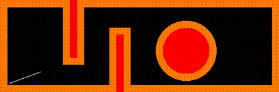

# Overview

The A* (pronounced "A-star") algorithm is a widely used path planning algorithm in robotics, which is employed for pathfinding and graph traversal, particularly in scenarios where the goal is to find the shortest path between two nodes in a graph. The work below is the implementation of A-star algorithm both in 2-D and 3-D (Gazbeo Simulation) using Python and ROS Noetic.

## Part - 1 (2-D Implementation)

### Instructions to Run the Code : 

1. Use the "Part1/vinay_anuj_part1.py" file from folder and open any Python IDE or terminal
2. If Python IDE is used, please click on the run button
Note : Before running please make sure whether these libraries are installed in the system : numpy,cv2,matplotlib,time.
Any Library not present can be by typing below command in terminal window using pip:
       pip install numpy
       
#### Input Format for Two Test Cases : Click on enter after entering a value at each prompt

```bash
	# Test Case 1 : 
	Enter the clearance of the robot (0-50 mm)
	 50
	Enter the Left RPM of the motor
	 30
	Enter the Right RPM of the motor
	 60
	Enter the x-coordinate of start node
	 20
	Enter the y-coordinate of start node
	 20
	Initial Orientation of start node of robot(Angle in multiple of 30)
	 30
	Enter the x-coordinate of goal node
	 300
	Enter the y-coordinate of goal node
	 170
```

```bash
	# Test Case 2 : 
	Enter the clearance of the robot (0-50 mm)
	 50
	Enter the Left RPM of the motor
	 80
	Enter the Right RPM of the motor
	 80
	Enter the x-coordinate of start node
	 20
	Enter the y-coordinate of start node
	 20
	Initial Orientation of start node of robot(Angle in multiple of 30)
	 30
	Enter the x-coordinate of goal node
	 230
	Enter the y-coordinate of goal node
	 80
```

4. Once the code is run, a few information about the code is printed on the console and the cv2 visualisation video is recorded and saved
5. Video will be saved under the name "A-Star.avi". Alternatively, you can find the video in below links
6. If Using, VSCode or Spyder you will also see a final plot of the map using Opencv and Matplotlib

### Results

The results can be viewed from results folder. The video below shows the A-Star planning executed in 2-D

<p align="center">
<br>
<em>Figure: A-Star Planning in 2-D</em>
</p>

## Part - 2 (3-D Implementation)
### Instructions to Run the Code : 

```bash
	#Test Case
	Enter the clearance of the robot (0-50 mm)
	 20
	Enter the Left RPM of the motor
	 30
	Enter the Right RPM of the motor
	 30
	Enter the x-coordinate of start node
	 20
	Enter the y-coordinate of start node
	 20
	Initial Orientation of start node of robot(Angle in multiple of 30)
	 0
	Enter the x-coordinate of goal node
	 100
	Enter the y-coordinate of goal node
	 20
```
1. First, download the folder from below path after extracting the zip
	* Part2/a_star_turtlebot
2. Keep this folder "a_star_turtlebot" inside the source folder of your respective ros workspace.
3. Perfrom below set of commands now on the terminal window
	* cd ~/catkin_ws
	* catkin_make
	* source devel/setup.bash
	* roslaunch a_star_turtlebot a_star_turtlebot.launch
4. A new terminal window will be opened where you need to enter the coordinates as in Test Case.
5. The turtlebot keeps moving to its goal point. The video link for the same is below:
	* Video Link : https://drive.google.com/file/d/17CIlDj8LbJArhJQW7Q3nB8XHnKwRrENC/view?usp=sharing

### Project Members:
1. Anuj Zore
2. Vinay Krishna Bukka